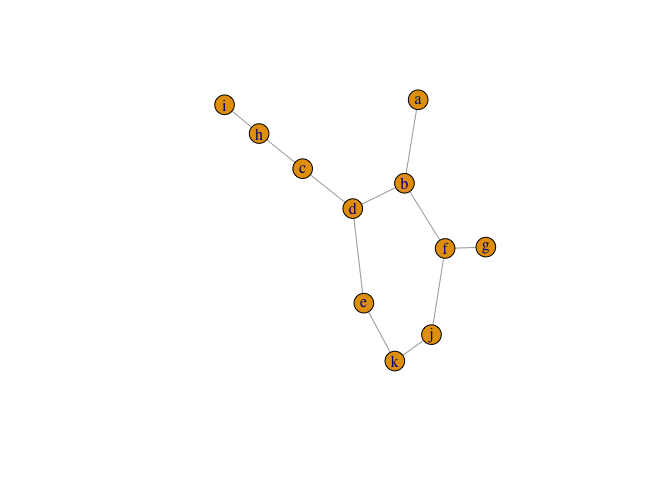

<!-- README.md is generated from README.Rmd. Please edit that file -->

# simplygraph

simplygraph provides functions to simplify graph topologies.

## Installation

You can install the development version of simplygraph from
[GitHub](https://github.com/cmu-lib/simplygraph) with:

``` r
# install.packages("devtools")
devtools::install_github("cmu-lib/simplygraph")
```

## Example

Say you have a graph where multiple nodes could be removed while still
maintaining the same intersections between paths:

``` r
set.seed(100)
library(igraph)
library(simplygraph)

graph <- igraph::graph_from_edgelist(
  matrix(c(
    "a", "b",
    "b", "f",
    "b", "d",
    "d", "c",
    "d", "e",
    "e", "k",
    "j", "k",
    "f", "g",
    "c", "h",
    "h", "i",
    "f", "j"
  ), ncol = 2, byrow = TRUE),
  directed = FALSE
)

plot(graph)
```



Nodes `j`, `k`, `e`, `c`, and `h` could be removed without fundamentally
altering the relationship of path intersections in this graph.
`simplify_topology()` finds those 2-degree nodes and removes them,
rewiring the remaining tangent nodes.

``` r
simple_graph <- simplify_topology(graph)

plot(simple_graph)
```


